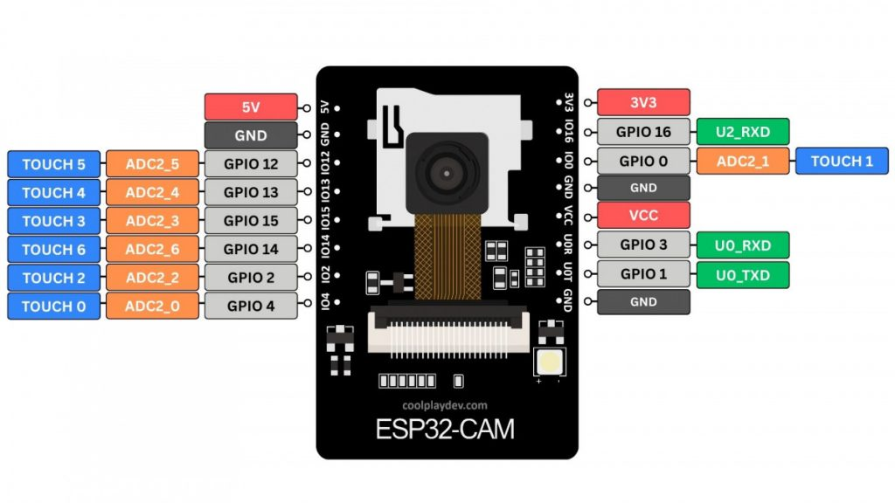

# AI Thinker ESP32-CAM

ESP32-WROOM-32-based development board with OV2640 camera, 4 MB PSRAM, and microSD slot. No on-board USB-serial — requires an external USB-to-UART adapter for programming.

## Links

- AI Thinker wiki: https://wiki.ai-thinker.com/esp32-cam
- Espressif camera driver: https://github.com/espressif/esp32-camera

## Photos



## Specifications

| Spec       | Detail                                         |
| ---------- | ---------------------------------------------- |
| MCU        | ESP32-WROOM-32 — Xtensa dual-core LX6, 240 MHz |
| Flash      | 4 MB                                           |
| PSRAM      | 4 MB (external)                                |
| Wireless   | Wi-Fi 802.11 b/g/n, Bluetooth 4.2 + BLE        |
| USB        | None (external UART adapter required)          |
| Camera     | OV2640, 2 MP, JPEG output                      |
| Camera IF  | SCCB (I2C-like) + 8-bit parallel DVP           |
| SD Card    | MicroSD slot (SPI mode)                        |
| Status LED | Red LED on GPIO 33 (active LOW)                |
| Flash LED  | White LED on GPIO 4                            |
| Antenna    | On-board PCB antenna                           |

## Pin Mapping — Camera (OV2640)

| Function | GPIO | Notes                   |
| -------- | ---- | ----------------------- |
| PWDN     | 32   | Camera power down       |
| RESET    | -1   | Not connected           |
| XCLK     | 0    | Master clock (10 MHz)   |
| SIOD     | 26   | SCCB data (SDA)         |
| SIOC     | 27   | SCCB clock (SCL)        |
| Y2       | 5    | Data bit 0              |
| Y3       | 18   | Data bit 1              |
| Y4       | 19   | Data bit 2              |
| Y5       | 21   | Data bit 3              |
| Y6       | 36   | Data bit 4 (input-only) |
| Y7       | 39   | Data bit 5 (input-only) |
| Y8       | 34   | Data bit 6 (input-only) |
| Y9       | 35   | Data bit 7 (input-only) |
| VSYNC    | 25   | Vertical sync           |
| HREF     | 23   | Horizontal reference    |
| PCLK     | 22   | Pixel clock             |

## Pin Mapping — SD Card (SPI)

| Function | GPIO |
| -------- | ---- |
| SPI_MOSI | 15   |
| SPI_MISO | 2    |
| SPI_SCLK | 14   |
| SD_CS    | 13   |

## Pin Mapping — Onboard Peripherals

| Function    | GPIO | Notes      |
| ----------- | ---- | ---------- |
| Status LED  | 33   | Active LOW |
| Flash LED   | 4    | White LED  |
| BOOT button | 0    |            |

## Free GPIOs (when camera is not active)

| GPIO | Notes                                |
| ---- | ------------------------------------ |
| 1    | UART TX (used for programming/debug) |
| 2    | SD MISO / general purpose            |
| 3    | UART RX (used for programming/debug) |
| 4    | Flash LED / general purpose output   |
| 12   | Boot strapping — must be LOW at boot |
| 13   | SD CS / general purpose              |
| 14   | SD CLK / general purpose             |
| 15   | SD MOSI / general purpose            |
| 16   | Must be HIGH at boot                 |

## PlatformIO

```ini
[env:esp32cam]
platform = espressif32
board = esp32cam
framework = arduino
board_build.partitions = min_spiffs.csv
build_flags =
  -DIS_ESP32CAM
  -DBOARD_HAS_PSRAM
  -DCONFIG_SPIRAM_CACHE_WORKAROUND
```

## Notes

- No on-board USB-serial chip — use an external FT232/CP2102 adapter on GPIO 1 (TX) and GPIO 3 (RX).
- GPIO 0 must be pulled LOW to enter bootloader/flash mode.
- GPIO 12 is a boot strapping pin — if HIGH at boot, flash voltage drops to 1.8V and may cause boot failure.
- PSRAM is essential for camera operation — OV2640 JPEG frames need large buffers.
- Camera config model: `CONFIG_CAMERA_MODEL_AI_THINKER`.
- GPIO 34, 35, 36, 39 are input-only (no pull-ups, no output).
- When camera is not needed, all camera GPIOs become available for general use.
- Projects in this repo: `06_wasserzaehler`, `08_eink`, `11_esp32cam_servo`, `12_esp32cam_stepper`, `23_LED_matrix`.
