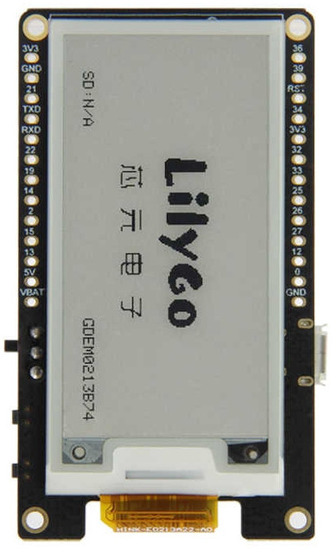

# LILYGO TTGO T5 V2.3 (2.13" E-Ink)

ESP32-based development board with a 2.13" e-ink display, microSD slot, battery management (IP5306), and user button. Designed for low-power display applications.

## Links

- LILYGO product page: https://www.lilygo.cc/products/t5-v2-3
- LILYGO GitHub: https://github.com/Xinyu-LilyGO/LilyGo-EPD-4-7
- GxEPD library: https://github.com/ZinggJM/GxEPD

## Photos



## Specifications

| Spec           | Detail                                           |
| -------------- | ------------------------------------------------ |
| MCU            | ESP32-WROOM-32 — Xtensa dual-core LX6, 240 MHz   |
| Flash          | 4 MB                                             |
| PSRAM          | Present (CONFIG_SPIRAM_CACHE_WORKAROUND enabled) |
| Wireless       | Wi-Fi 802.11 b/g/n, Bluetooth 4.2 + BLE          |
| USB            | Micro USB (CP2104 / CH9102 USB-serial)           |
| Display        | 2.13" e-ink, monochrome, SPI                     |
| Display Panel  | GDEH0213B73 (V2.3) / GDEM0213B74 (V2.3.1)        |
| Display Driver | SSD1675B (V2.3) / SSD1680 (V2.3.1)               |
| Resolution     | 122 x 250 (V2.3) / 104 x 212 (V2.3.1)            |
| SD Card        | MicroSD slot (SPI)                               |
| Battery        | IP5306 power management IC (I2C addr 0x75)       |
| LED            | GPIO 19, active LOW                              |
| Button         | GPIO 39 (ADC: 4095=unpressed, 0=pressed)         |
| ADC            | GPIO 35 (battery voltage sense)                  |

### Panel Variant Note

| Variant | Panel       | Controller | Resolution | GxEPD Class     |
| ------- | ----------- | ---------- | ---------- | --------------- |
| V2.3    | GDEH0213B73 | SSD1675B   | 122 x 250  | `GxGDEH0213B73` |
| V2.3.1  | GDEM0213B74 | SSD1680    | 104 x 212  | `GxGDEM0213B74` |

The codebase uses `GxGDEH0213B73` (V2.3 panel). If using the newer V2.3.1 board, switch to `GxGDEM0213B74`.

## Pin Mapping — E-Ink Display (SPI)

| Function  | GPIO | Notes          |
| --------- | ---- | -------------- |
| SPI_MOSI  | 23   |                |
| SPI_MISO  | -1   | Not used       |
| SPI_SCLK  | 18   |                |
| EPD_CS    | 5    | Chip select    |
| EPD_DC    | 17   | Data/Command   |
| EPD_RESET | 16   | Hardware reset |
| EPD_BUSY  | 4    | Busy status    |

## Pin Mapping — SD Card (SPI, separate bus)

| Function | GPIO |
| -------- | ---- |
| SPI_MOSI | 15   |
| SPI_MISO | 2    |
| SPI_SCLK | 14   |
| SD_CS    | 13   |

## Pin Mapping — Onboard Peripherals

| Function    | GPIO | Notes                             |
| ----------- | ---- | --------------------------------- |
| LED         | 19   | Active LOW                        |
| Button      | 39   | Input-only, ADC (4095=up, 0=down) |
| Battery ADC | 35   | Input-only, battery voltage sense |

## Pin Mapping — Project-Specific

### CAN Bus (15_power_log_eink)

| Function | GPIO |
| -------- | ---- |
| CAN_TX   | 21   |
| CAN_RX   | 22   |

### Stepper Motors (08_eink)

| Function        | GPIO |
| --------------- | ---- |
| Stepper1 Step   | 33   |
| Stepper1 Dir    | 32   |
| Stepper1 Enable | 25   |
| Stepper2 Step   | 26   |
| Stepper2 Dir    | 27   |
| Stepper2 Enable | 12   |

## PlatformIO

```ini
[env:lilygo-t5-v2.3]
platform = espressif32
board = esp32dev
framework = arduino
board_build.partitions = min_spiffs.csv
build_flags =
  -DBOARD=LILYGO_V2_3
  -DCONFIG_SPIRAM_CACHE_WORKAROUND
lib_deps =
  GxEPD @ ^3.1.0
  Adafruit BusIO @ ^1.7.1
```

## Notes

- Two separate SPI buses: e-ink on default SPI (GPIO 18/23), SD card on VSPI (GPIO 14/15/2/13).
- E-ink SPI MISO is unused (e-ink displays are write-only).
- Full e-ink refresh takes ~8 seconds; partial refresh is faster but may cause ghosting.
- The on-board LED on GPIO 19 is active LOW.
- IP5306 power management IC can be controlled via I2C (address 0x75) for battery charging and boost control.
- Projects in this repo: `08_eink`, `15_power_log_eink`.
