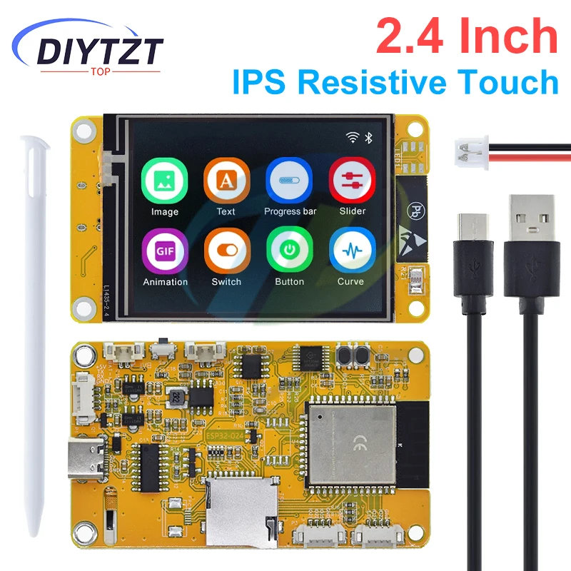
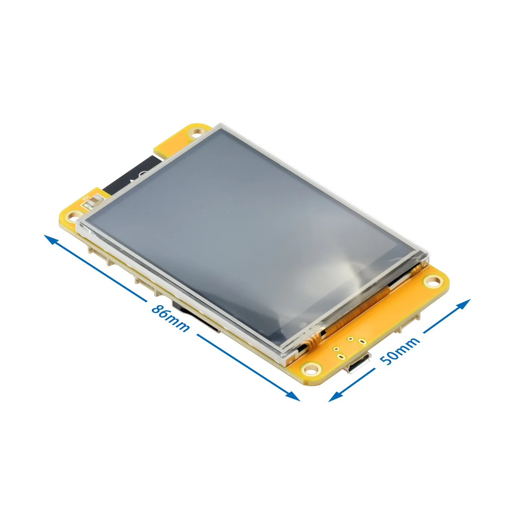

# SUNTON ESP32-2432S024R (2.4" LCD TFT with Touch)

ESP32-WROOM-32 development board with 2.4" TFT LCD, resistive touch, SD card slot, RGB LED, speaker, and light sensor. Part of the SUNTON "CYD" family.

## Links

- AliExpress: https://de.aliexpress.com/item/1005007286667162.html
- Board definitions + GPIO mappings: https://github.com/rzeldent/platformio-espressif32-sunton
- LVGL driver for all SUNTON boards: https://github.com/rzeldent/esp32-smartdisplay

## Photos




## Dimensions



## Pinout / Schematics


## Specifications

| Spec           | Detail                                             |
| -------------- | -------------------------------------------------- |
| MCU            | ESP32-WROOM-32 — Xtensa dual-core LX6, 240 MHz     |
| Flash          | 4 MB                                               |
| PSRAM          | None                                               |
| Wireless       | Wi-Fi 802.11 b/g/n, Bluetooth 4.2 + BLE            |
| USB            | Micro USB                                          |
| Display        | 2.4" TFT LCD, 240 x 320, SPI                       |
| Display Driver | ILI9341                                            |
| Touch          | XPT2046 resistive (SPI)                            |
| Audio          | FM8002A amplifier, speaker connector (JST 1.25 2p) |
| SD Card        | TF slot (SPI)                                      |
| RGB LED        | Common anode (active LOW)                          |
| Light Sensor   | CdS photoresistor (GT36516)                        |
| I2C Expansion  | 2x JST 1.0 4-pin connectors                        |
| Power/Serial   | JST 1.25 4-pin connector                           |
| Battery        | JST 1.25 2-pin connector                           |

### Variants

| Variant         | Touch                    | Notes                       |
| --------------- | ------------------------ | --------------------------- |
| ESP32-2432S024N | None                     | No touch                    |
| ESP32-2432S024R | XPT2046 (resistive, SPI) |                             |
| ESP32-2432S024C | CST820 (capacitive, I2C) | Upward compat. with CST816S |

## Pin Mapping — Display (ILI9341, SPI)

| Function      | GPIO |
| ------------- | ---- |
| SPI_MOSI      | 13   |
| SPI_MISO      | 12   |
| SPI_SCLK      | 14   |
| TFT_CS        | 15   |
| TFT_DC        | 2    |
| TFT_BACKLIGHT | 27   |
| TFT_RST       | N/A  |

## Pin Mapping — Touch (XPT2046, SPI)

| Function  | GPIO                     |
| --------- | ------------------------ |
| SPI_MOSI  | 13 (shared with display) |
| SPI_MISO  | 12 (shared with display) |
| SPI_SCLK  | 14 (shared with display) |
| TOUCH_CS  | 33                       |
| TOUCH_INT | 36                       |

Note: Touch **shares the same SPI bus** (SPI2_HOST) with the display. Only CS differs.

## Pin Mapping — SD Card (SPI)

| Function | GPIO |
| -------- | ---- |
| SPI_MOSI | 23   |
| SPI_MISO | 19   |
| SPI_SCLK | 18   |
| SD_CS    | 5    |

## Pin Mapping — Onboard Peripherals

| Function           | GPIO | Notes        |
| ------------------ | ---- | ------------ |
| RGB_LED_R          | 4    | Active LOW   |
| RGB_LED_G          | 16   | Active LOW   |
| RGB_LED_B          | 17   | Active LOW   |
| SPEAKER            | 26   | DAC2 / I2S   |
| CDS (light sensor) | 34   | Analog input |
| BOOT button        | 0    |              |

## Differences from 2.8" (ESP32-2432S028R)

| Feature              | 2.4" (this board)          | 2.8"                 |
| -------------------- | -------------------------- | -------------------- |
| Display backlight    | GPIO 27                    | GPIO 21              |
| Touch SPI bus        | Shared with display (SPI2) | Separate (SPI3)      |
| Touch MOSI/MISO/SCLK | 13/12/14 (shared)          | 32/39/25 (dedicated) |

## PlatformIO

```ini
[env:esp32-2432S024r]
platform = espressif32
board = esp32dev
framework = arduino
monitor_speed = 115200
board_build.partitions = default.csv
build_flags =
  -DARDUINO_ESP32_DEV
```

For the smartdisplay LVGL driver, add the board definition repository as a git submodule in `<project>/boards/` and use the [esp32-smartdisplay](https://github.com/rzeldent/esp32-smartdisplay) library.

## Notes

- The RGB LED is active LOW — set GPIO LOW to turn on, HIGH to turn off.
- Display and touch share the same SPI bus — only the CS pin differs.
- The SD card uses a separate SPI bus (GPIO 23/19/18/5).
- The additional flash chip (W25Q32JV) is not always mounted on the board.
