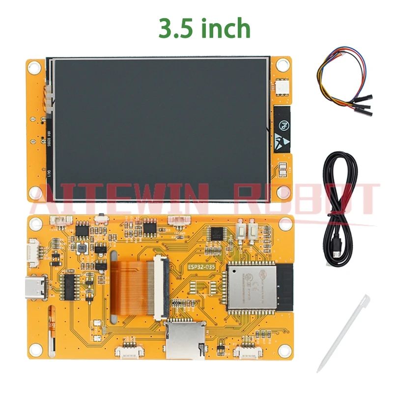
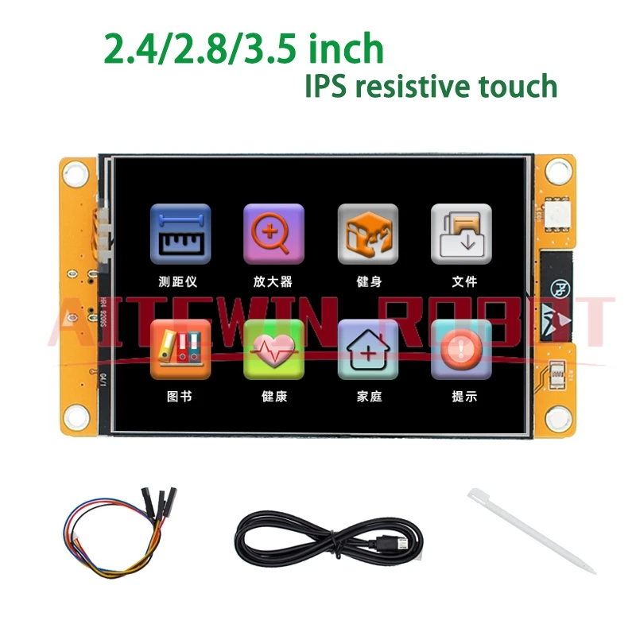
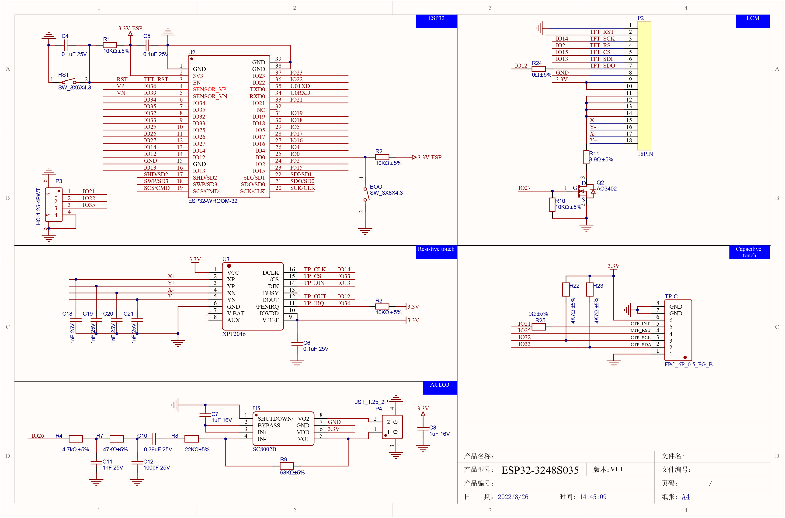
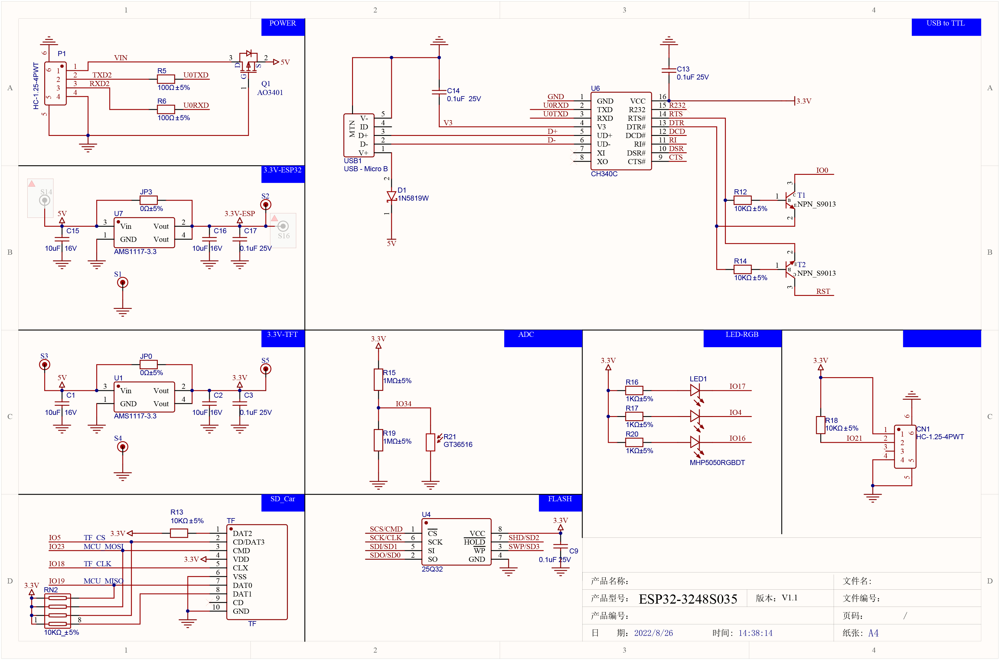

# SUNTON ESP32-3248S035 (3.5" LCD TFT)

ESP32-WROOM-32 development board with 3.5" TFT LCD, touch screen, SD card slot, RGB LED, speaker, and light sensor. Part of the SUNTON "CYD" (Cheap Yellow Display) family.

Available in two variants:

- **ESP32-3248S035C** — Capacitive touch (GT911)
- **ESP32-3248S035R** — Resistive touch (XPT2046)

## Links

- AliExpress: https://de.aliexpress.com/item/1005007544966311.html
- Board definitions + GPIO mappings: https://github.com/rzeldent/platformio-espressif32-sunton
- LVGL driver for all SUNTON boards: https://github.com/rzeldent/esp32-smartdisplay
- PCB schematic (R variant): [ESP32-3248S035R-PCB.pdf](https://github.com/rzeldent/platformio-espressif32-sunton/blob/main/assets/schematics/ESP32-3248S035R-PCB.pdf)

## Photos






## Pinout / Schematics





## Specifications

| Spec              | Detail                                             |
| ----------------- | -------------------------------------------------- |
| MCU               | ESP32-WROOM-32 — Xtensa dual-core LX6, 240 MHz     |
| Flash             | 4 MB                                               |
| PSRAM             | None                                               |
| Wireless          | Wi-Fi 802.11 b/g/n, Bluetooth 4.2 + BLE            |
| USB               | Micro USB                                          |
| Display           | 3.5" TFT LCD, 320 x 480, SPI                       |
| Display Driver    | ST7796                                             |
| Touch (C variant) | GT911 capacitive (I2C)                             |
| Touch (R variant) | XPT2046 resistive (SPI)                            |
| Audio             | FM8002A amplifier, speaker connector (JST 1.25 2p) |
| SD Card           | TF slot (SPI)                                      |
| RGB LED           | Common anode (active LOW)                          |
| Light Sensor      | CdS photoresistor (GT36516)                        |
| I2C Expansion     | 2x JST 1.0 4-pin connectors                        |
| Power/Serial      | JST 1.25 4-pin connector                           |

## Pin Mapping — Display (ST7796, SPI)

| Function      | GPIO |
| ------------- | ---- |
| SPI_MOSI      | 13   |
| SPI_MISO      | 12   |
| SPI_SCLK      | 14   |
| TFT_CS        | 15   |
| TFT_DC        | 2    |
| TFT_BACKLIGHT | 27   |
| TFT_RST       | N/A  |

## Pin Mapping — Touch

### Capacitive (GT911, I2C) — ESP32-3248S035C

| Function  | GPIO |
| --------- | ---- |
| I2C_SDA   | 33   |
| I2C_SCL   | 32   |
| TOUCH_RST | 25   |
| TOUCH_INT | 21   |

### Resistive (XPT2046, SPI) — ESP32-3248S035R

| Function | GPIO |
| -------- | ---- |
| SPI_MOSI | 13   |
| SPI_MISO | 12   |
| SPI_SCLK | 14   |
| TOUCH_CS | 33   |

## Pin Mapping — SD Card (SPI)

| Function | GPIO |
| -------- | ---- |
| SPI_MOSI | 23   |
| SPI_MISO | 19   |
| SPI_SCLK | 18   |
| SD_CS    | 5    |

## Pin Mapping — Onboard Peripherals

| Function           | GPIO | Notes        |
| ------------------ | ---- | ------------ |
| RGB_LED_R          | 4    | Active LOW   |
| RGB_LED_G          | 16   | Active LOW   |
| RGB_LED_B          | 17   | Active LOW   |
| SPEAKER            | 26   | DAC2 / I2S   |
| CDS (light sensor) | 34   | Analog input |
| BOOT button        | 0    |              |

## PlatformIO

```ini
[env:esp32-3248S035c]
platform = espressif32
board = esp32dev
framework = arduino
monitor_speed = 115200
board_build.partitions = default.csv
build_flags =
  -DARDUINO_ESP32_DEV
```

For the smartdisplay LVGL driver, add the board definition repository as a git submodule in `<project>/boards/` and use the [esp32-smartdisplay](https://github.com/rzeldent/esp32-smartdisplay) library.

## Notes

- The RGB LED is active LOW — set GPIO LOW to turn on, HIGH to turn off.
- The SD card SPI bus uses different pins than the display SPI bus.
- The additional flash chip (W25Q32JV) is not always mounted on the board.
- For audio via I2S, use GPIO26 as DAC2 (left channel only). GPIO25 is connected to GT911 touch on some boards.
- The speaker output has a JST 1.25mm 2-pin connector for an 8-ohm speaker.
