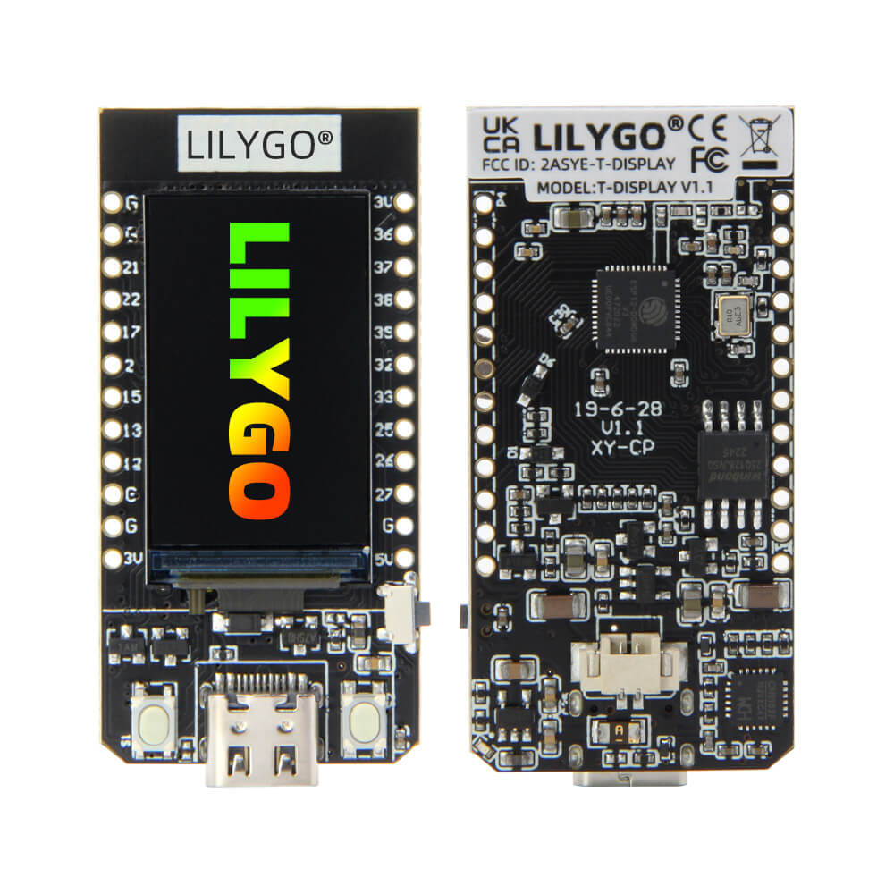
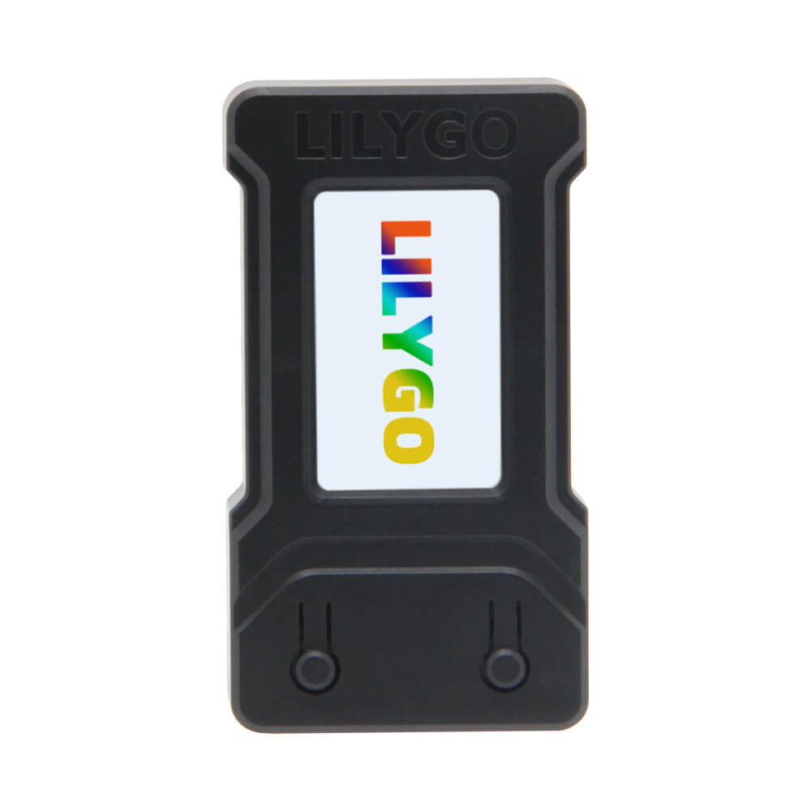
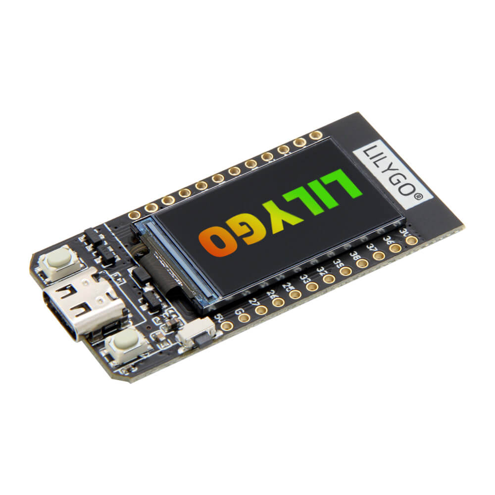
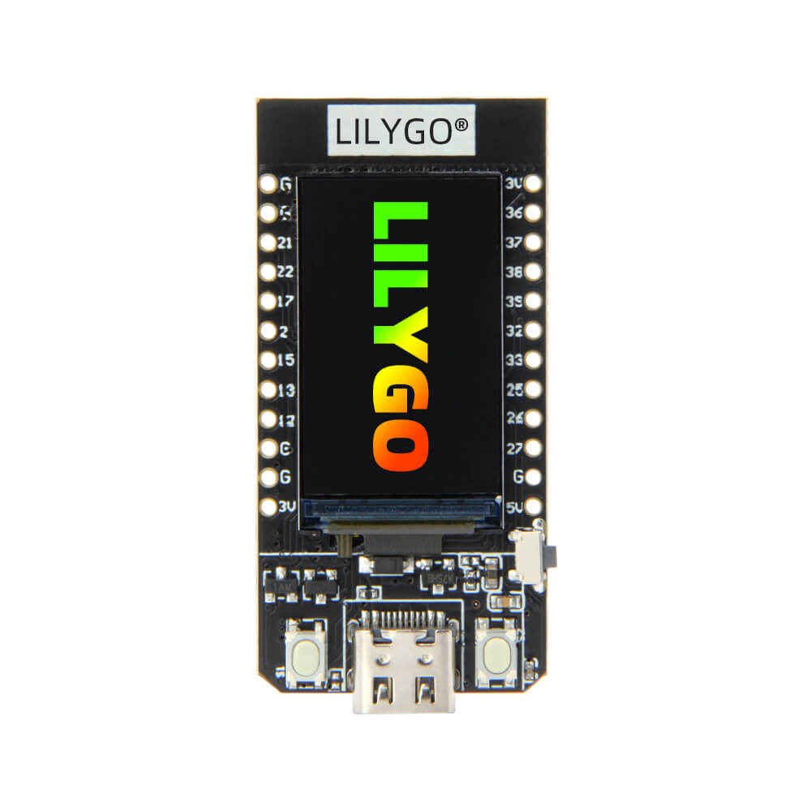
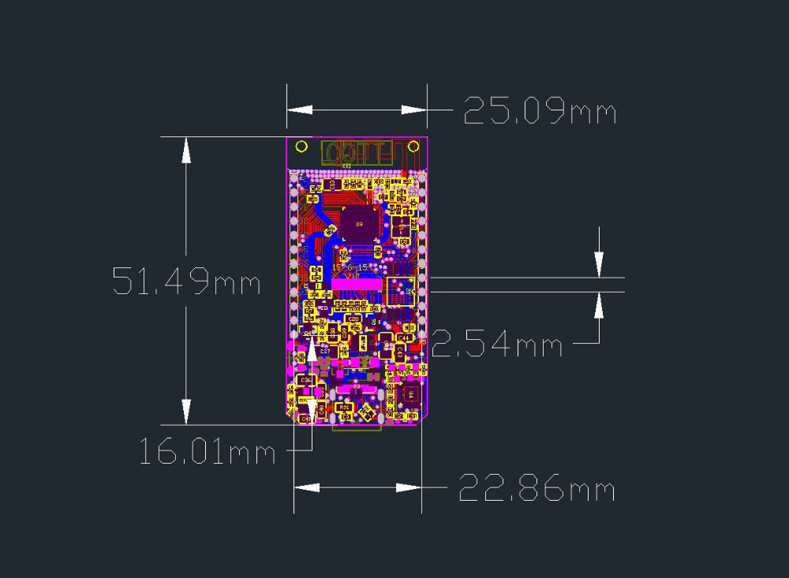
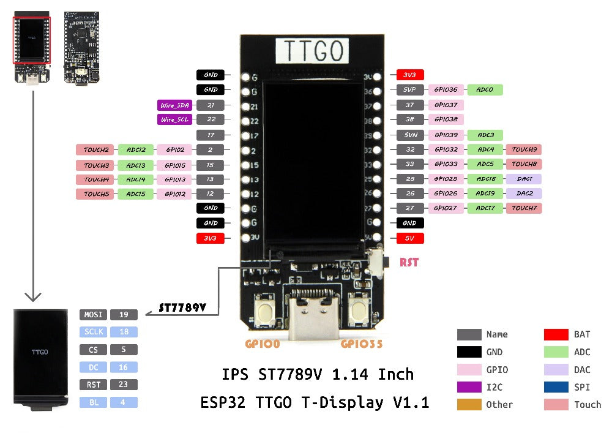
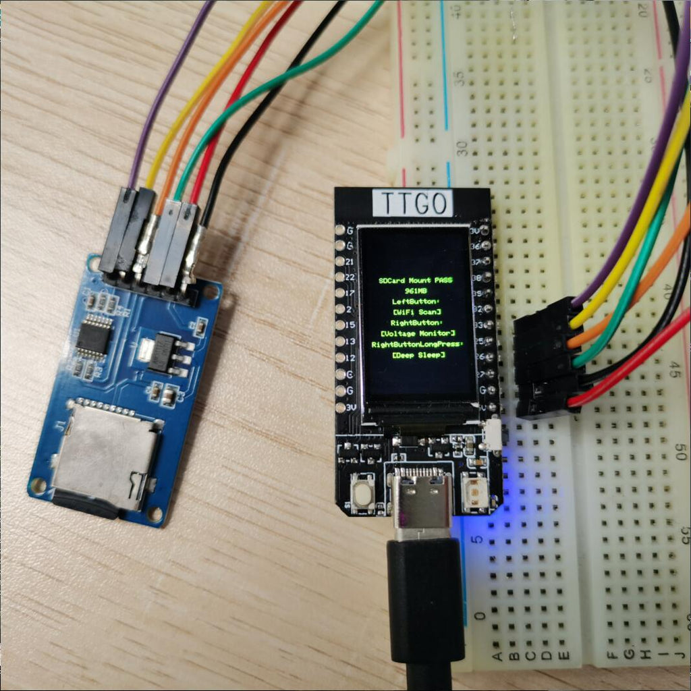

# LILYGO T-Display (TTGO T-Display)

ESP32-D0WD development board with integrated 1.14" ST7789V TFT LCD.

## GitHub

- Repository: https://github.com/Xinyu-LilyGO/T-Display
- LILYGO official: https://www.lilygo.cc/products/t-display
- CH9102 drivers (Mac/Windows): https://www.lilygo.cc (Document-Tool section)

## Photos









## Board Dimensions



## Connection Diagram / Pinout



## SD Card Connection (second SPI example)



## Specifications

| Spec           | Detail                                   |
| -------------- | ---------------------------------------- |
| MCU            | ESP32-D0WD Xtensa dual-core LX6, 240 MHz |
| USB-UART       | CH9102F                                  |
| Flash          | 4 MB or 16 MB                            |
| PSRAM          | None                                     |
| Wireless       | Wi-Fi 802.11 b/g/n, Bluetooth 4.2 + BLE  |
| Programming    | Arduino IDE, MicroPython, PlatformIO     |
| Certifications | CE / FCC / UKCA / MIC                    |
| Board Size     | ~51.5 x 25.4 mm                          |

## Display - 1.14" ST7789V IPS TFT LCD

| Spec          | Detail     |
| ------------- | ---------- |
| Resolution    | 135 x 240  |
| Pixel Density | 260 PPI    |
| Interface     | 4-wire SPI |
| Driver IC     | ST7789V    |
| Voltage       | 3.3V       |

## Pin Mapping

| Function  | GPIO | Notes                 |
| --------- | ---- | --------------------- |
| TFT_MOSI  | 19   |                       |
| TFT_SCLK  | 18   |                       |
| TFT_CS    | 5    |                       |
| TFT_DC    | 16   |                       |
| TFT_BL    | 4    | Backlight             |
| TFT_RST   | N/A  | Not connected         |
| TFT_MISO  | N/A  | Not connected         |
| I2C_SDA   | 21   |                       |
| I2C_SCL   | 22   |                       |
| ADC_IN    | 34   |                       |
| BUTTON1   | 35   |                       |
| BUTTON2   | 0    | BOOT button           |
| ADC Power | 14   | Battery voltage sense |

## Arduino IDE Quick Start

1. Install **TFT_eSPI** library
2. Configure `User_Setup.h` in TFT_eSPI for ST7789 with the pins above
3. Select board: **ESP32 Dev Module**
4. Set Flash Size: **4MB** (or 16MB)
5. Set PSRAM: **Disable**

## PlatformIO

```ini
[env:tdisplay]
platform = espressif32
board = esp32dev
framework = arduino
monitor_speed = 115200
board_build.partitions = default.csv
```
