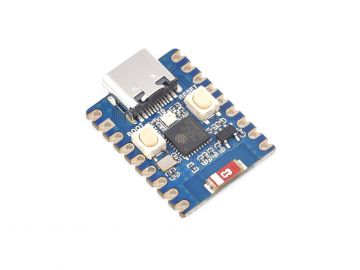
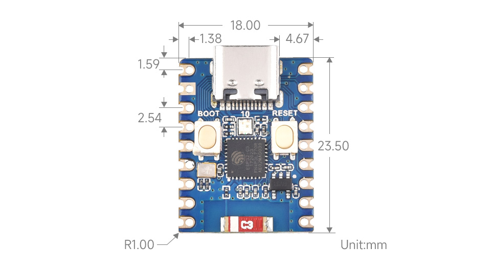

# TENSTAR ESP32-C3-Zero (C3 Supermini)

Ultra-small ESP32-C3-FH4 development board with USB Type-C, ceramic antenna, and castellated holes for direct PCB integration.

## Links

- AliExpress: https://de.aliexpress.com/item/1005009890203011.html
- Waveshare Wiki (reference): https://www.waveshare.com/wiki/ESP32-C3-Zero

## Photos






## Specifications

| Spec          | Detail                                                  |
| ------------- | ------------------------------------------------------- |
| MCU           | ESP32-C3-FH4 — RISC-V 32-bit single-core, up to 160 MHz |
| Flash         | 4 MB                                                    |
| PSRAM         | None                                                    |
| SRAM          | 400 KB                                                  |
| ROM           | 384 KB                                                  |
| Wireless      | Wi-Fi 802.11 b/g/n (2.4 GHz), Bluetooth 5 (LE)          |
| USB           | Type-C (native USB, no UART bridge)                     |
| Antenna       | Onboard ceramic antenna                                 |
| RGB LED       | WS2812 on GPIO10                                        |
| Buttons       | BOOT (GPIO9), RESET                                     |
| Input Voltage | 5V (USB) or 3.7–6V (5V pin)                             |
| Logic Level   | 3.3V                                                    |
| GPIO          | 15 pins exposed (GPIO12–17 used for Flash)              |
| Board Size    | ~23 x 18 mm                                             |

## Key Notes

- **No USB-UART chip** — uses ESP32-C3 native USB. To enter download mode: hold BOOT, connect USB, release BOOT.
- GPIO12–GPIO17 are **not exposed** (used internally for Flash).
- Default UART0: TX = GPIO21, RX = GPIO20.
- WS2812 RGB LED on **GPIO10**.
- For Arduino IDE: enable **"USB CDC On Boot"** for Serial output.

## Peripherals

- 3x SPI
- 1x I2C
- 2x UART
- 1x I2S
- 2x ADC

## PlatformIO

```ini
[env:esp32-c3-zero]
platform = espressif32
board = esp32-c3-devkitm-1
framework = arduino
monitor_speed = 115200
```
