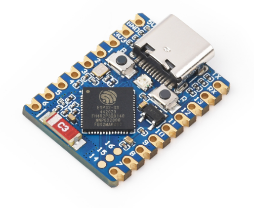
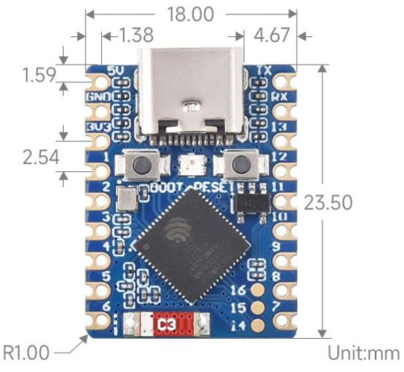
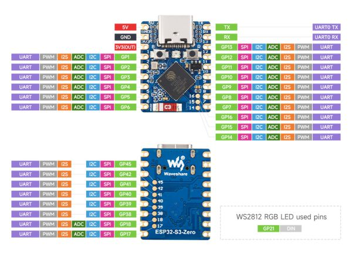

# TENSTAR ESP32-S3-Zero

Ultra-small ESP32-S3-FH4R2 development board with USB Type-C, ceramic antenna, and castellated holes for direct PCB integration.

## Links

- AliExpress: https://de.aliexpress.com/item/1005009890203011.html
- Waveshare Wiki (reference): https://www.waveshare.com/wiki/ESP32-S3-Zero

## Photos






## Pinout



## Specifications

| Spec              | Detail                                                      |
| ----------------- | ----------------------------------------------------------- |
| MCU               | ESP32-S3-FH4R2 — Xtensa 32-bit LX7 dual-core, up to 240 MHz |
| Flash             | 4 MB                                                        |
| PSRAM             | 2 MB (Octal)                                                |
| SRAM              | 512 KB                                                      |
| ROM               | 384 KB                                                      |
| Wireless          | Wi-Fi 802.11 b/g/n (2.4 GHz), Bluetooth 5 (LE)              |
| USB               | Type-C (native USB, no UART bridge)                         |
| Antenna           | Onboard ceramic antenna                                     |
| RGB LED           | WS2812 on GPIO21                                            |
| Buttons           | BOOT (GPIO0), RESET                                         |
| Voltage Regulator | ME6217C33M5G (800 mA LDO)                                   |
| Input Voltage     | 5V (USB) or 3.7–6V (5V pin)                                 |
| Logic Level       | 3.3V                                                        |
| GPIO              | 24 pins exposed (GPIO33–37 used by PSRAM)                   |
| Board Size        | ~23 x 18 mm                                                 |

## Key Notes

- **No USB-UART chip** — uses ESP32-S3 native USB. To enter download mode: hold BOOT, connect USB, release BOOT.
- GPIO33–GPIO37 are **not exposed** (used internally for Octal PSRAM).
- Default UART0: TX = GPIO43, RX = GPIO44.
- WS2812 RGB LED on **GPIO21**.
- For Arduino IDE: enable **"USB CDC On Boot"** for Serial output.
- For PlatformIO: use board `esp32-s3-devkitm-1`.

## Peripherals

- 4x SPI
- 2x I2C
- 3x UART
- 2x I2S
- 2x ADC
- Touch sensor
- LED PWM
- Motor PWM (MCPWM)
- USB serial/JTAG

## PlatformIO

```ini
[env:esp32-s3-zero]
platform = espressif32
board = esp32-s3-devkitm-1
framework = arduino
monitor_speed = 115200
board_build.flash_mode = dio
board_upload.before_reset = usb_reset
```
